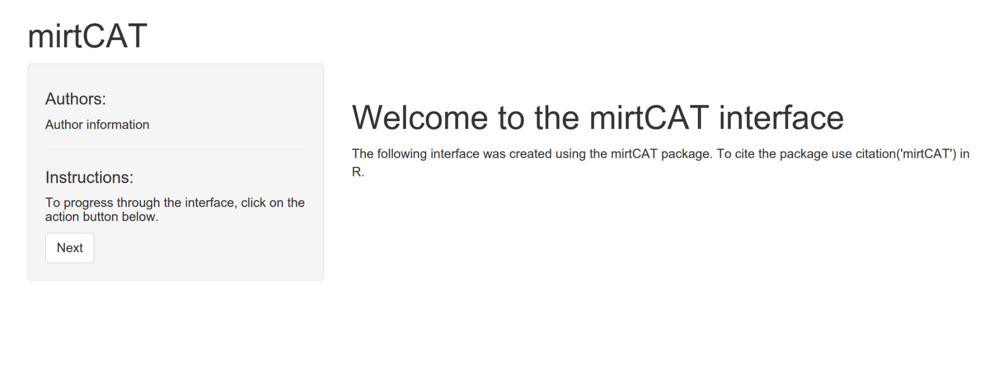
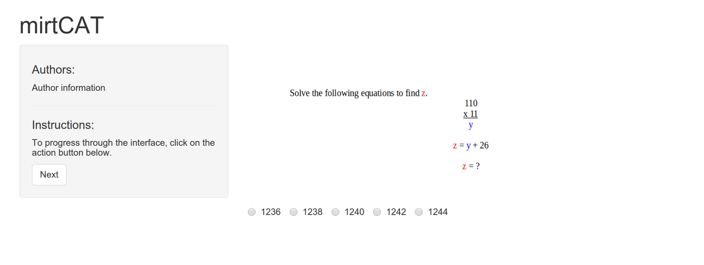

[](https://travis-ci.org/philchalmers/mirtCAT) [](https://www.r-pkg.org:443/pkg/mirtCAT) [](https://CRAN.R-project.org/package=mirtCAT)

# mirtCAT

Computerized Adaptive Testing with Multidimensional Item Response Theory



## Description

Provides tools to generate an HTML interface for creating adaptive
and non-adaptive educational and psychological tests using the shiny
package. Suitable for applying unidimensional and multidimensional
computerized adaptive tests using item response theory methodology.

## Examples and Evaluated Help Files

Various examples and worked help files have been compiled using the `knitr` package to generate
HTML output, and are available on the [wiki](https://github.com/philchalmers/mirtCAT/wiki).
User contributions are welcome!




# Installing from Github

To install the development version of this package, use the following code.

```r
#if not installed already on your computer, install devtools
install.packages('devtools')

#load and install the package
library('devtools')
install_github('philchalmers/mirtCAT')

#reload the package
library('mirtCAT')
```

# Bugs and Questions

Bug reports are always welcome and the preferred way to address these bugs is through
the Github 'issues'. Feel free to submit issues or feature requests on the site, and I'll
address them ASAP. Also, if you have any questions about the package, or IRT in general, then
feel free to create a 'New Topic' in the
[mirt-package](https://groups.google.com/forum/#!forum/mirt-package) Google group. Cheers!
